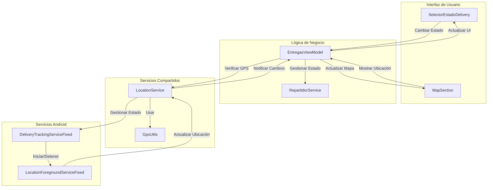
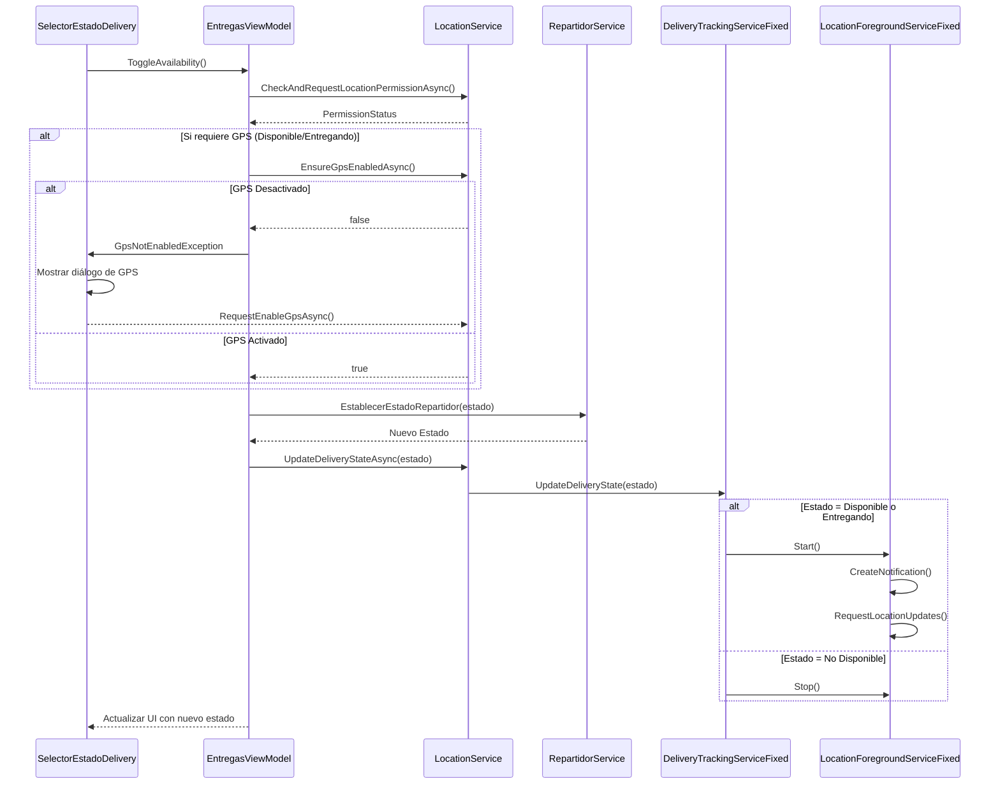
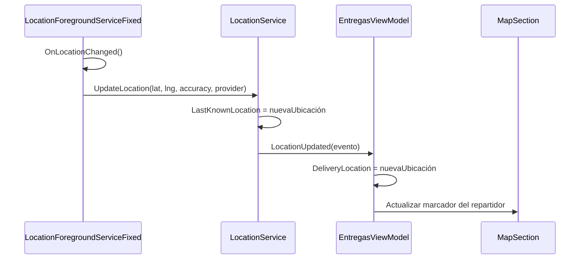
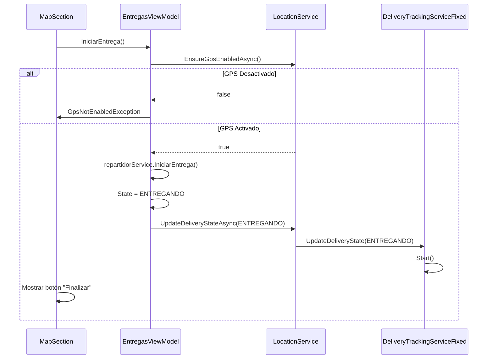
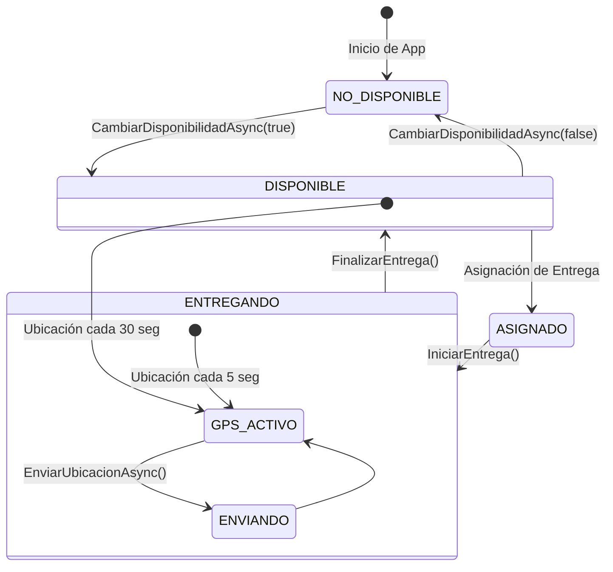
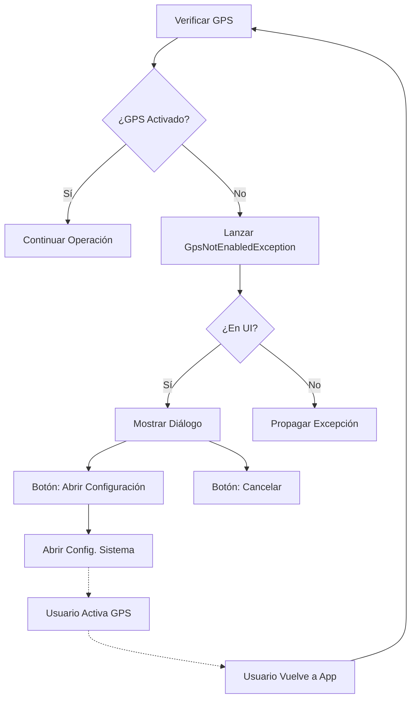

# Sistema de Localización para Dhahabi Delivery

## Índice
1. [Descripción General](#descripción-general)
2. [Arquitectura del Sistema](#arquitectura-del-sistema)
3. [Componentes Principales](#componentes-principales)
4. [Flujos de Trabajo](#flujos-de-trabajo)
5. [Estados del Repartidor](#estados-del-repartidor)
6. [Manejo de Errores](#manejo-de-errores)
7. [Integración con UI](#integración-con-ui)
8. [Permisos y Consideraciones de Seguridad](#permisos-y-consideraciones-de-seguridad)
9. [Optimizaciones de Rendimiento](#optimizaciones-de-rendimiento)
10. [FAQ y Solución de Problemas](#faq-y-solución-de-problemas)

## Descripción General

El Sistema de Localización de Dhahabi Delivery permite rastrear la ubicación de los repartidores durante sus entregas, con gestión eficiente de recursos del dispositivo y sincronización entre diferentes estados del repartidor. El sistema está diseñado para:

- Rastrear la ubicación del repartidor solo cuando es necesario
- Mostrar la posición actual en el mapa cuando se realiza una entrega
- Verificar y solicitar permisos de ubicación automáticamente
- Manejar casos cuando el GPS está desactivado
- Optimizar el uso de batería según el estado del repartidor
- Proporcionar una interfaz de usuario intuitiva para cambiar estados

## Arquitectura del Sistema

## Componentes Principales

### LocationService
- **Propósito**: Servicio centralizado que gestiona la ubicación y estados del repartidor
- **Características**:
  - Singleton registrado en el contenedor DI
  - Manejo de estados del repartidor (Disponible, No disponible, Entregando)
  - Verificación de permisos de ubicación
  - Notificación de cambios de ubicación mediante eventos
  - Interfaz unificada para plataformas Android, iOS y otras

### LocationForegroundServiceFixed
- **Propósito**: Servicio nativo de Android que gestiona el rastreo de ubicación en primer plano
- **Características**:
  - Notificaciones persistentes para servicio en primer plano
  - Optimizaciones de energía según el estado del repartidor
  - Soporte para Android 8.0+ con canales de notificación
  - Múltiples proveedores de ubicación (GPS + Red)
  - Manejo de errores y registro de eventos

### DeliveryTrackingServiceFixed
- **Propósito**: Punto de entrada para iniciar/detener el servicio de ubicación
- **Características**:
  - Interfaz estática para uso en código compartido
  - Actualización del estado del repartidor
  - Comunicación directa con el servicio en ejecución

### EntregasViewModel
- **Propósito**: Coordinar la lógica de negocio y comunicación entre UI y servicios
- **Características**:
  - Manejo del estado del repartidor y entregas
  - Suscripción a eventos de ubicación
  - Actualización de marcadores en el mapa
  - Manejo de errores específicos para GPS

### GpsUtils
- **Propósito**: Utilidades para verificar y solicitar activación del GPS
- **Características**:
  - Verificación del estado del GPS
  - Apertura de configuración del sistema para activar GPS

## Flujos de Trabajo

### Cambio de Estado del Repartidor

### Rastreo de Ubicación

### Iniciar Entrega

## Estados del Repartidor

## Manejo de Errores

## Integración con UI

### SelectorEstadoDelivery
El componente permite al repartidor cambiar su estado entre "Disponible" y "No Disponible":

- Interfaz moderna con toggle switch animado
- Indicadores visuales del estado actual
- Manejo de errores específicos para GPS
- Diálogos informativos cuando se requiere acción del usuario

### MapSection
El componente muestra la ubicación del repartidor durante una entrega:

- Marcador de posición del cliente
- Marcador dinámico de la posición actual del repartidor
- Animación "pulsante" para mayor visibilidad
- Controles para iniciar/finalizar entregas

## Permisos y Consideraciones de Seguridad

### Permisos Requeridos
- `ACCESS_FINE_LOCATION`: Para acceso preciso a la ubicación
- `ACCESS_COARSE_LOCATION`: Como alternativa cuando la ubicación precisa no está disponible
- `FOREGROUND_SERVICE`: Para ejecutar el servicio en primer plano
- `FOREGROUND_SERVICE_LOCATION`: Para Android 14+ (API 34)

### Políticas de Privacidad
- La ubicación solo se rastrea cuando el repartidor está en estado "Disponible" o "Entregando"
- La frecuencia de actualización se reduce en estado "Disponible" para ahorrar batería
- Cuando el repartidor no está disponible, el servicio se detiene completamente
- Los datos de ubicación solo se envían al backend durante entregas activas

## Optimizaciones de Rendimiento

### Gestión de Batería
- Frecuencia de actualización variable según el estado:
  - Entregando: Actualizaciones cada 5 segundos
  - Disponible: Actualizaciones cada 30 segundos
  - No Disponible: Sin actualizaciones

### Proveedores de Ubicación
- GPS (alta precisión): Proveedor principal
- Red (bajo consumo): Proveedor secundario como respaldo

### Desuscripción de Eventos
- Limpieza adecuada de recursos mediante Cleanup()
- Desuscripción de eventos cuando componentes son destruidos

## FAQ y Solución de Problemas

### ¿Por qué no se actualiza mi ubicación en el mapa?
1. Verifica que el GPS esté activado
2. Asegúrate de estar en estado "Entregando"
3. Comprueba los permisos de ubicación en la configuración

### ¿Por qué aparece el diálogo de GPS constantemente?
El diálogo aparece porque el GPS está desactivado. En lugar de fallar silenciosamente, la aplicación solicita explícitamente activar el GPS.

### ¿Cuánto consume de batería el servicio de ubicación?
El consumo varía según el estado:
- No Disponible: 0% (servicio detenido)
- Disponible: Bajo (actualizaciones cada 30 segundos)
- Entregando: Moderado (actualizaciones cada 5 segundos)
